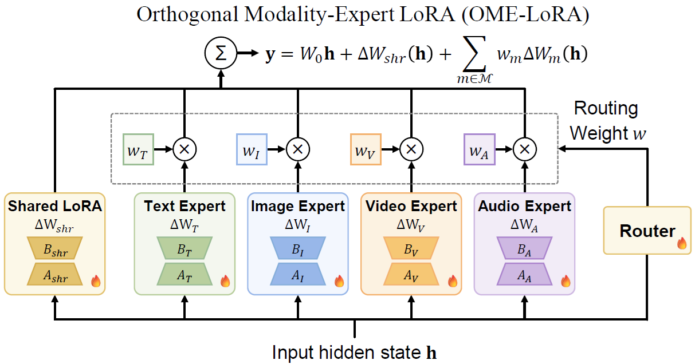

# Syn-Omni: Structured Specialization and Progressive Collaboration for Omnimodal Embeddings

Youngtaek Oh, Qiyu Wu, Hiromi Wakaki, Junmo Kim, Yuki Mitsufuji

EMNLP 2026 Findings

📄 Paper (coming soon) &nbsp;|&nbsp; 🤗 Models (coming soon)

This repository contains the evaluation code for Syn-Omni: 81 tasks across image, video, audio, and audiovisual modalities, plus scripts for 5 baseline models.

## Abstract

Omnimodal embeddings naturally involve both shared representations and modality-specific features across heterogeneous inputs. However, existing omnimodal embedding methods often rely on a single shared parameter space over mixed-modality data, limiting structural separation between universal and modality-specific representations. To address this, we propose Syn-Omni, a unified framework for structured omnimodal adaptation with modality specialization and controlled cross-modal collaboration. Specifically, we introduce Orthogonal Modality-Expert LoRA (OME-LoRA), which decomposes adaptation into a shared LoRA path for universal semantics and modality-expert LoRA paths for modality-aware specialization. Furthermore, Progressive Synergy Routing (PSR) enables experts to first establish modality-specific priors, then gradually interact with other modality-experts for cross-modal synergy. Evaluated across 81 diverse tasks spanning image, video, audio, and audiovisual modalities, Syn-Omni consistently outperforms omnimodal baselines, demonstrating the effectiveness of structured specialization and cross-modal progressive collaboration.

<p align="center">
  
</p>

<br />

## Installation

### Install via Docker (Recommended)

```bash
cd docker
docker build --build-arg USER_ID=$UID -t omniembed:v0 .

docker run --gpus all -it --shm-size=128gb \
    -v <path/to/code>:/home/appuser/omni \
    -v <path/to/datasets>:/home/appuser/datasets \
    -v <path/to/.cache/huggingface>:/home/appuser/.cache/huggingface \
    -v <path/to/.cache/torch/hub>:/home/appuser/.cache/torch/hub \
    --name synomni omniembed:v0
```

### Install without Docker

```bash
cd vlm2vec_eval
pip install -r requirements_local.txt
```

This installs everything the Docker image normally provides. See the comments at the top of the file for install order.

Install flash-attn separately, last:

```bash
pip install flash_attn==2.8.3 --no-build-isolation
```

<br />

## Dataset Setup

1. Download MMEB-V2 (image/video tasks) once:

   ```bash
   cd vlm2vec_eval
   DATA_BASEDIR=/path/to/vlm2vec_eval_data bash experiments/public/data/download_data.sh
   ```

   - Defaults to `/home/appuser/datasets/vlm2vec_eval` if unset.
   - Also settable via `scripts/env.sh`.

2. Everything else (audio and audiovisual) downloads automatically the first time you run an eval script. No manual step needed.

<br />

## Useful Guide

- `src/model/`: model/backbone loading, including the custom router-based LoRA (OME-LoRA / PSR) used by Syn-Omni.
- `src/data/eval_dataset/`: per-dataset eval loaders.
- `src/data/collator/`: batch collation, including on-the-fly video/audio decoding.
- `src/constant/`: dataset name to HF/source mapping.
- `src/utils/`: download helpers, eval utilities.
- `experiments/public/eval/*.yaml`: per-modality dataset configs.
- `scripts/baselines/`: eval scripts for baseline models.

<br />

## Evaluation

All eval scripts live under `scripts/` and share `scripts/env.sh` for `DATA_BASEDIR`/`OUTPUT_BASEDIR`.

### Baselines

One script per model under `scripts/baselines/`. Most load their checkpoint from a public HF repo id and run as-is.

- `eval_wave.sh` expects `tsinghua-ee/WAVE-7B` downloaded locally first.
- `multivent.sh` expects `Tevatron/OmniEmbed-v0.1-multivent` downloaded locally first.

<br />

## Acknowledgements

- Built on top of [VLM2Vec](https://github.com/TIGER-AI-Lab/VLM2Vec) ([Apache License 2.0](https://github.com/TIGER-AI-Lab/VLM2Vec/blob/main/LICENSE)). This repository is a modified fork, released under the same license.
- Also builds on [Tevatron](https://github.com/texttron/tevatron).

<br />

## Citation

```bibtex
TBD
```
